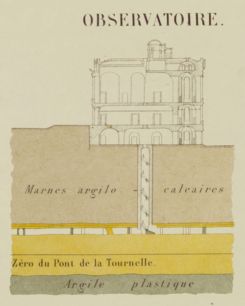

# Kta2Géo

* *Environment : #/bin/bash!*
* *Requirement : **gdal exiftool wget imagemagick***
* EPSG:27561 --> EPSG:3857



* Usage : Start program > then choose menu

```
Folder/Kta2Geo/Start_Program.sh
```
#### GeoRefIGC :

* Georeference maps in EPSG:3857 from source maps in Lambert1 EPSG:27561 based on filename.

NTF (Paris) / Lambert Nord France  EPSG:27561

#### kmz2csv :

* Convert KMZ to CSV & Geotag images

#### Feuilles2Planches :

* Convert name Old "feuille 281" to "25-50"

#### Geoserver_operations

* Create a Workspace on Geoserver
* Post Geotif files to geoserver and set-up layers using REST.

#### Observatoire_Long_Lat-Converter

* Conversion Long/Lat from Paris meridian Observatoire - unit : mètre

### Name convention :

##### Maps image format : .jpg, .tif, and .kmz files.

Original .jpeg or .tif files must be stored in :

###### I.G.C post 1968 E.g : 25-50

```
Folder/25-50_Whatever_1971.tif
```

```
Folder/[Abscissa]-[Ordinate]_Whatever_version-numéro_Whatever_l'année.l'extension
```

```
Folder/25-50_plan des carrières Denfert_V-1_Source_BHVP_1971.tif
```

Output :

```
Folder/_Output/25-50-V1-1971.tif
```

###### I.G.C pre 1968 E.g : Feuille 281

```
Folder/281_V1-1931.tif
```

```
Folder/_Output/281_V1-1931.tif
```

###### Département de la Seine

```
Folder/26Y_V1-1951.tif
```

output :

```
Folder/_Output/26Y_V1-1951.tif
```

###### De Fourcy 1858

ATLAS SOUTERRAIN DE LA VILLE DE PARIS.

```
Folder/P00_Planche_0_Assemblage_DeFourcy_1958.tif
Folder/P05_Planche_1_DeFourcy_1958.tif
Folder/P06_Planche_2_DeFourcy_1958.tif
Folder/P07_Planche_3_DeFourcy_1958.tif
Folder/P08_Planche_4_DeFourcy_1958.tif
Folder/P09_Planche_5_DeFourcy_1958.tif
Folder/P10_Planche_6_DeFourcy_1958.tif
Folder/P11_Planche_7_DeFourcy_1958.tif
Folder/P12_Planche_8_DeFourcy_1958.tif
Folder/P13_Planche_9_DeFourcy_1958.tif
Folder/P14_Planche_10_DeFourcy_1958.tif
Folder/P15_Planche_11_DeFourcy_1958.tif
Folder/P16_Detail_Ossuaire_1860.tif
Folder/P16_Planche_12_DeFourcy_1958.tif
Folder/P17_Planche_13_DeFourcy_1958.tif
Folder/P18_Planche_14_DeFourcy_1958.tif
Folder/P19_Planche_15_DeFourcy_1958.tif
Folder/P20_Planche_16_DeFourcy_1958.tif
Folder/P21_Planche_17_DeFourcy_1958.tif
```

```
Folder/_Output/PXX_Planche_XX_DeFourcy_1958.tif
```

##### Kmz files

```
Folder/WhateverName.kmz
```

Ouput images & .csv

```
Folder/_Output/WhateverName(Folder)
```

#### Special case :

INSPECTION GÉNÉRALE DES CARRIÈRES DE LA SEINE

ATLAS DES CARRIÈRES SOUTERRAINES DU DÉPARTEMENT - 1962

TABLEAU D'ASSEMBLAGE

Echelle: 1 :50000.

```
"Folder/_Atlas_des_Carrières_du_département_1962.tif"
```
